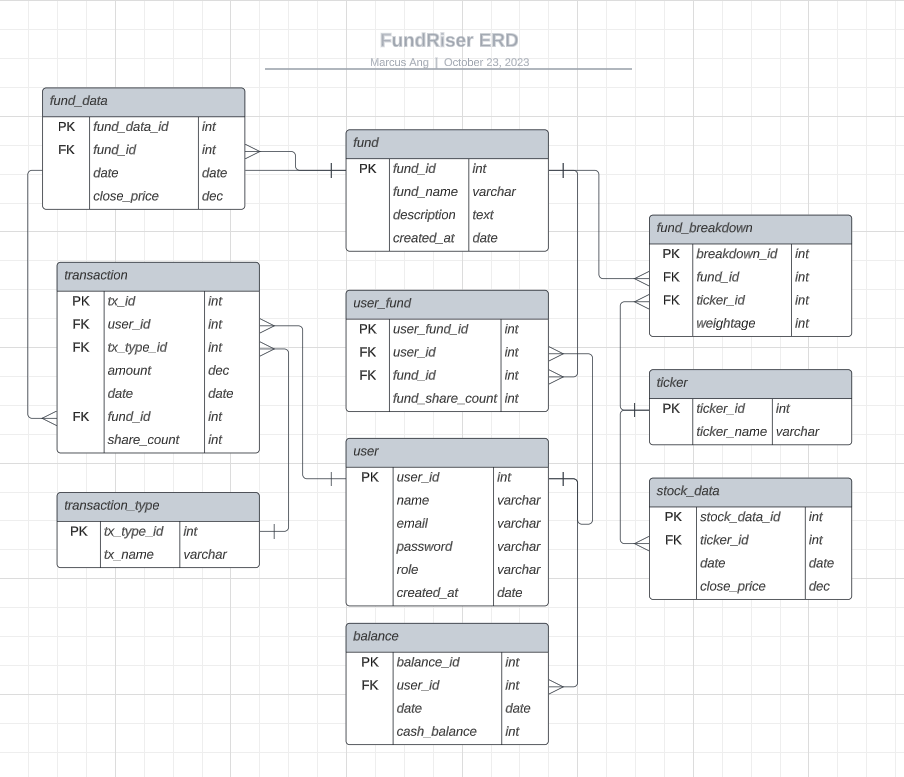

# FundRiser - Professional Fund Management Platform 💰

## Table of Contents

1. [Introduction](#introduction)
2. [Planning](#planning)
3. [Technologies](#technologies)
4. [Deployment](#deployment)
5. [Future Developments](#future-developments)

---

## Introduction

FundRiser is your trusted partner in financial growth and investment success.

With a dedication to excellence and a commitment to secure and profitable investments, we offer you a seamless and effortless journey into the world of financial freedom.

---

## Planning

- **Github Projects**: Various user stories for FundRiser can be found on [Github Projects](https://github.com/users/marcusawd/projects/2).

- **ERD**: The following is the draft of the Entity Relationship Diagram
  

---

## Technologies

- **Frontend**: ReactJS, React-Bootstrap
- **Backend**: Node.js, Express.js
- **Database**: PostgreSQL
- **Other Technologies**: JsonWebToken, node-pg, Request, Moment, ReCharts
- **External API**: Alpha Query stock Api

---

## Deployment

Try out FundRiser [here]().

---

## Future Developments

- **Shifting of growth logic to backend**: Currently fundData is derived in the frontend, making updating very tricky.
- **Standardise queries**:
  1. Use node-pg Transaction for all DB queries that requires more than 1 query. (Only started doing that in the later half of my project)
  2. Move queries into their own queries.js for modular sake
- **ERD tables**: Finish the incomplete ERD tables in order to store periodic data based on date (Balance and share count of User)
- **More detailed user analysis**: Using monthly balances create greater analysis and breakdown of user portfolio using dates
